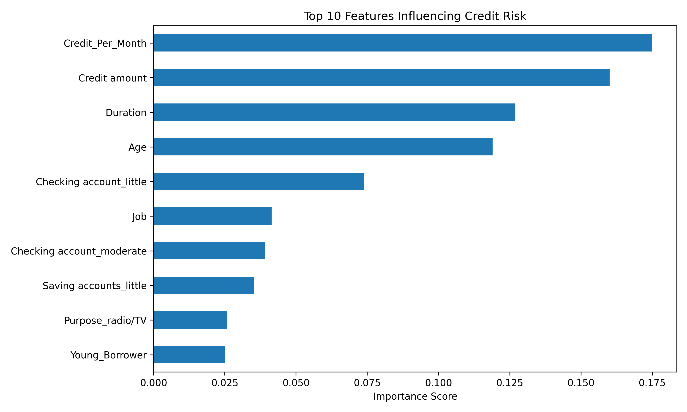

# AI Credit Risk Prediction

## Project Overview

This project applies Machine Learning techniques to predict borrower credit risk using structured financial data. Financial institutions use credit risk models to evaluate loan applications and minimize losses arising from borrower defaults.

The project demonstrates a complete machine learning workflow including:

* Data Preprocessing
* Exploratory Data Analysis (EDA)
* Feature Engineering
* Model Development
* Cross Validation
* Hyperparameter Optimization
* Feature Importance Analysis

---

## Problem Statement

The objective is to classify loan applicants as either:

* Good Risk
* Bad Risk

based on demographic and financial attributes such as age, loan amount, account status, repayment duration, and borrowing purpose.

---

## Dataset

**Source:** German Credit Risk Dataset

Dataset Characteristics:

* 1,000 loan applications
* Structured financial and demographic attributes
* Binary classification target (Good Risk / Bad Risk)

Key Features:

* Age
* Credit Amount
* Duration
* Housing Status
* Savings Account Status
* Checking Account Status
* Purpose of Loan

Target Variable:

* Risk

---

## Machine Learning Workflow

### 1. Data Preprocessing

* Removed unnecessary index column
* Handled missing values
* Encoded categorical variables using one-hot encoding

### 2. Feature Engineering

Created additional predictive features:

* Credit_Per_Month
* Young_Borrower

### 3. Model Development

Implemented:

* Logistic Regression
* Random Forest Classifier

### 4. Model Evaluation

Performance was evaluated using:

* Accuracy
* Precision
* Recall
* F1 Score
* ROC-AUC

### 5. Model Validation

Performed 5-Fold Cross Validation using ROC-AUC scoring to evaluate model robustness.

### 6. Hyperparameter Optimization

Used GridSearchCV to determine the optimal Random Forest configuration.

Best Parameters:

* max_depth = 5
* n_estimators = 100

---

## Results

| Metric                  | Value |
| ----------------------- | ----- |
| Accuracy                | 78.5% |
| Precision               | 78.0% |
| Recall                  | 96.4% |
| F1 Score                | 86.3% |
| ROC-AUC                 | 0.741 |
| Cross-Validated ROC-AUC | 0.755 |

---

## Feature Importance

The Random Forest model identified the following variables as the strongest predictors of borrower credit risk:

1. Credit_Per_Month
2. Credit Amount
3. Duration
4. Age
5. Checking Account Status

These findings suggest that repayment burden and loan characteristics play a significant role in determining borrower creditworthiness.

---

## Key Findings

* Repayment burden was the strongest predictor of credit risk.
* Credit amount and loan duration significantly influenced borrower classification.
* Borrower age contributed meaningfully to model predictions.
* Cross-validation confirmed stable model performance across multiple data splits.
* Hyperparameter optimization showed that simpler Random Forest configurations generalized more effectively.

---

## Technologies Used

* Python
* Pandas
* NumPy
* Scikit-Learn
* Matplotlib
* Jupyter Notebook

---

## Future Improvements

Potential enhancements include:

* XGBoost Implementation
* SHAP Explainability Analysis
* Advanced Feature Engineering
* Class Imbalance Handling
* Model Deployment using Flask or Streamlit

---

## Author

Divyanshi Negi

B.Tech Computer Science (AI for IoT)

Interested in Machine Learning, AI Research, and Financial AI Applications.
